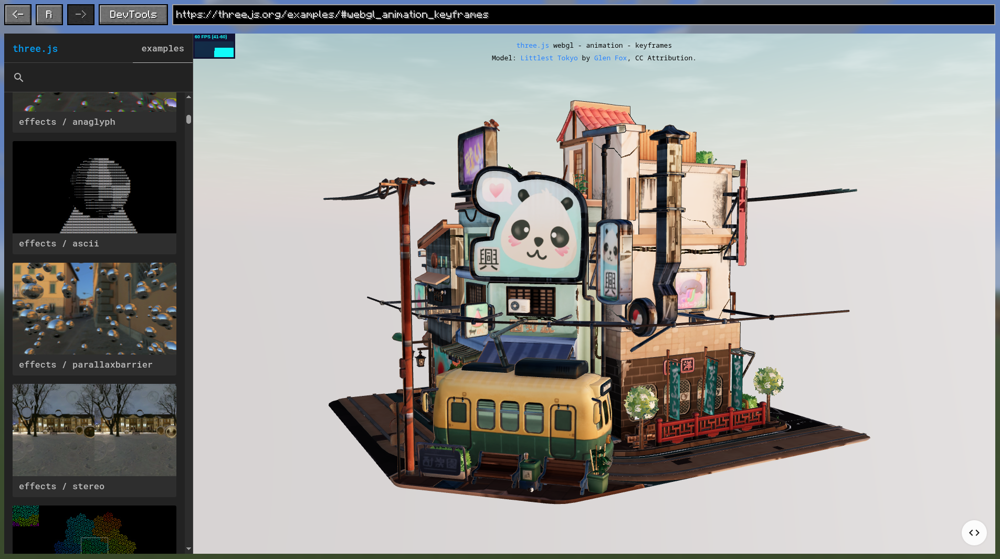

# Graphene

[](https://modrinth.com/mod/grapheneui)
[](https://github.com/trethore/graphene/releases)
[](https://central.sonatype.com/artifact/io.github.trethore/graphene-ui-26.2)
[](https://central.sonatype.com/artifact/io.github.trethore/graphene-ui-1.21.11)
[](LICENSE)

Graphene is a client-side UI library for Minecraft that lets mod developers build interfaces with web technologies.
It embeds Chromium through JCEF, so you can render HTML/CSS/JavaScript UIs in-game while keeping a clean Java API for
mod integration.



## What is Graphene?

Graphene bridges Minecraft modding and modern web UI development. Instead of building every screen with Minecraft's
rendering primitives, you can create interfaces with HTML, CSS, and JavaScript, then integrate them with your mod
through a Java API.

Graphene provides:

- interactive Chromium views that can be embedded in Minecraft screens;
- packaged asset URLs and an optional development HTTP server;
- two-way Java/JavaScript communication through an asynchronous bridge;
- browser navigation, input, downloads, dialogs, context menus, and lifecycle controls;
- off-screen browser sessions and surfaces for custom rendering integrations;
- Chromium DevTools support for inspecting and debugging pages.

Check [compatibility and installation](docs/reference/compatibility-and-installation.md) for supported Minecraft and
Loader versions.

## Requirements

- Java: `25` for Minecraft 26.2, `21` for Minecraft 1.21.11
- GPU: `NVIDIA GeForce GT 720` or better
- For macOS users: macOS 12 (Monterey) or later

## Supported Platforms

- macOS: `arm64`, `amd64`
- Linux: `arm64`, `amd64`
- Windows: `amd64`, `arm64`

## Tested Platforms

- Windows 11 with `AZERTY` and `QWERTY` keyboard layouts
- Linux (Wayland) with `AZERTY` and `QWERTY` keyboard layouts
- macOS 26 with `QWERTY` keyboard layout

## Installation

Graphene is published on Maven Central. Find the latest version on [GitHub Releases](https://github.com/trethore/graphene/releases),
[Modrinth](https://modrinth.com/mod/grapheneui), or the Minecraft-version-specific Maven Central artifacts, then add
the artifact matching your target Minecraft version as a mod dependency:

```kotlin
repositories {
    mavenCentral()
}

dependencies {
    modImplementation("io.github.trethore:graphene-ui-26.2:<version>")
    // Or for Minecraft 1.21.11:
    // modImplementation("io.github.trethore:graphene-ui-1.21.11:<version>")
}
```

Declare Graphene as a runtime dependency in `fabric.mod.json`:

```json
{
  "depends": {
    "grapheneui": ">=<version>"
  }
}
```

Register your mod from its client initializer and retain the returned context:

```java
import io.github.trethore.graphene.api.Graphene;
import io.github.trethore.graphene.api.GrapheneContext;
import net.fabricmc.api.ClientModInitializer;

public final class ExampleModClient implements ClientModInitializer {
    private static GrapheneContext graphene;

    @Override
    public void onInitializeClient() {
        graphene = Graphene.register(ExampleModClient.class);
    }

    public static GrapheneContext graphene() {
        return graphene;
    }
}
```

See those documentation pages for more details:

- [compatibility and installation](docs/reference/compatibility-and-installation.md) for compatibility details
- [first web-screen tutorial](docs/tutorials/first-web-screen.md) for a complete example

## Contributing

Contributions are welcome!

- Read the contributor guide in [CONTRIBUTING.md](CONTRIBUTING.md).
- Report bugs or request features in [Issues](https://github.com/trethore/graphene/issues).
- Open changes through [Pull Requests](https://github.com/trethore/graphene/pulls).
- All pull requests must be tested before being submitted.

## Documentation

Start [HERE](docs/README.md)!

## License

Licensed under the [MIT License](LICENSE) by Titouan Réthoré.
