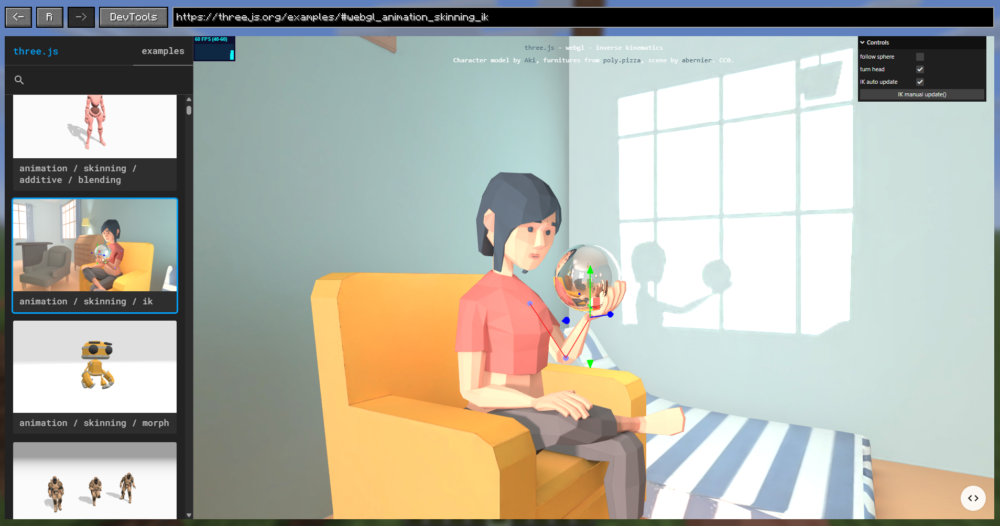

# Graphene

[](https://modrinth.com/mod/fabric-api)
[](LICENSE)
[](https://www.minecraft.net/)
[](https://modrinth.com/mod/grapheneui)

Graphene is a client-side UI library for Minecraft 1.21.11 (Fabric) that lets mod developers build interfaces with web technologies.
It embeds Chromium through JCEF, so you can render HTML/CSS/JavaScript UIs in-game while keeping a clean Java API for mod integration.



## What is Graphene?

Graphene is meant to bridge Minecraft modding and modern web UI development.

Instead of writing every screen directly with Minecraft rendering primitives, you can:

- build rich, responsive interfaces using browser capabilities;
- connect those interfaces to your mod logic through Graphene's API;
- iterate on UI faster with familiar web tooling and patterns;
- keep the integration focused on Fabric + Minecraft 1.21.11.

In short: Graphene gives Fabric mods a practical way to use web-powered interfaces without reinventing a full UI stack inside the game.

## Requirements

- Java: `21`
- GPU: `NVIDIA GeForce GT 720` or better
- For macOS users: macOS 12 (Monterey) or later

## Supported Platforms

- macOS: `arm64`, `amd64`
- Linux: `arm64`, `amd64`
- Windows: `amd64`, `arm64`

## Tested Platforms

- Windows 11 with `AZERTY` and `QWERTY` keyboard layouts
- Linux (Wayland) with `AZERTY` and `QWERTY` keyboard layouts
- macOS 26 with `QWERTY` keyboard layout (thanks to @Thinkseal for testing on macOS)

## Installation

Graphene is published on Maven Central and GitHub Packages.

We recommend using Maven Central for ease of use (no authentication required).

Check [Maven Central](https://repo1.maven.org/maven2/io/github/trethore/graphene-ui/) for the latest version.

### Maven coordinates

```xml
<dependency>
  <groupId>io.github.trethore</groupId>
  <artifactId>graphene-ui</artifactId>
  <version>&lt;version&gt;</version>
</dependency>
```

### Add Graphene to a Fabric Minecraft Gradle project

Primary model (recommended): keep Graphene as a separate mod dependency.

```kotlin
repositories {
    mavenCentral()
}

dependencies {
    modImplementation("io.github.trethore:graphene-ui:<version>")
}
```

Note: Graphene is also available on GitHub Packages.

In your `fabric.mod.json`, declare:

```json
{
  "depends": {
    "graphene-ui": ">=<version>"
  }
}
```

At runtime, place both jars in `mods/`: your mod jar and `graphene-ui-<version>.jar`.

Jar-in-jar embedding is also possible, but it is not the preferred default. See [docs/installation.md](docs/installation.md) for the trade-offs and setup.

### Initialize Graphene in your mod

Register your mod from `onInitializeClient()` with an anchor class. Graphene resolves the owning Fabric mod id from that class, and you can later resolve the scoped `GrapheneHandle` from the same anchor class:

```java
import net.fabricmc.api.ClientModInitializer;
import tytoo.grapheneui.api.GrapheneCore;

public final class MyModClient implements ClientModInitializer {
    @Override
    public void onInitializeClient() {
        GrapheneCore.register(MyModClient.class);
    }
}
```

Graphene separates per-consumer container settings from shared runtime settings.
`jcefDownloadPath(...)` is a base directory, and Graphene installs JCEF under `<jcef-mvn-version>/<platform>`.

```java
import java.nio.file.Path;
import net.fabricmc.api.ClientModInitializer;
import tytoo.grapheneui.api.GrapheneCore;
import tytoo.grapheneui.api.GrapheneHandle;
import tytoo.grapheneui.api.config.GrapheneConfig;
import tytoo.grapheneui.api.config.GrapheneContainerConfig;
import tytoo.grapheneui.api.config.GrapheneGlobalConfig;
import tytoo.grapheneui.api.config.GrapheneHttpConfig;
import tytoo.grapheneui.api.config.GrapheneRemoteDebugConfig;

public final class MyModClient implements ClientModInitializer {
    @Override
    public void onInitializeClient() {
        GrapheneCore.register(
                MyModClient.class,
                GrapheneConfig.builder()
                        .container(GrapheneContainerConfig.builder()
                                .http(GrapheneHttpConfig.builder()
                                        .bindHost("127.0.0.1")
                                        .randomPortInRange(20_000, 21_000)
                                        .fileRoot(Path.of("C:/dev/my-ui-dist"))
                                        .spaFallback("/assets/my-mod-id/web/index.html")
                                        .build())
                                .build())
                        .global(GrapheneGlobalConfig.builder()
                                .jcefDownloadPath(Path.of("./graphene-jcef"))
                                .extensionFolder(Path.of("./config/my-mod/extensions"))
                                .remoteDebugging(GrapheneRemoteDebugConfig.builder()
                                        .randomPort()
                                        .allowedOrigins("https://chrome-devtools-frontend.appspot.com")
                                        .build())
                                .build())
                        .build()
        );
    }
}
```

Use the handle for namespaced helpers:

```java
GrapheneHandle graphene = GrapheneCore.handle(MyModClient.class);

String appUrl = graphene.appAssets().asset("web/index.html");
String mountedHttpUrl = graphene.httpUrl("web/index.html");
```

## Documentation

Start [HERE](docs/README.md)!

## Contributing

Contributions are welcome!

- Report bugs or request features in [Issues](https://github.com/trethore/graphene/issues).
- Open changes through [Pull Requests](https://github.com/trethore/graphene/pulls).
- All pull requests must be tested before being submitted.

## License

Licensed under the [MIT License](LICENSE) by Titouan Réthoré.
