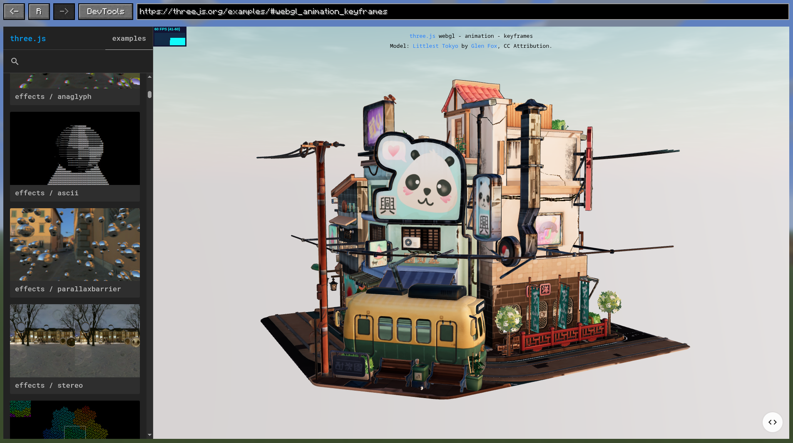

# Graphene Documentation

Graphene is a client-side UI library for Minecraft mods. It renders HTML, CSS, and JavaScript inside Minecraft by
embedding Chromium through JCEF, while exposing a Java API for screens, browser control, assets, and JavaScript
communication.

## Start here

Graphene supports Minecraft 26.2, 26.1.2, and 1.21.11 on Fabric.

If Graphene is not in your project yet, [install Graphene](how-to/install-graphene.md). Then follow the tutorials in
order:

1. [Build your first web screen](tutorials/first-web-screen.md) to register Graphene, load packaged assets, and display
   a browser widget.
2. [Connect Java and JavaScript](tutorials/connect-java-and-javascript.md) to exchange events and request/response
   messages.

## Tutorials

Use tutorials when you are learning Graphene through a complete, guided result.

- [Build your first web screen](tutorials/first-web-screen.md)
- [Connect Java and JavaScript](tutorials/connect-java-and-javascript.md)

## How-to guides

Use how-to guides when you already know the result you need.

- [Install Graphene](how-to/install-graphene.md)
- [Manage assets and frontend development](how-to/manage-assets-and-frontend-development.md)
- [Control and observe the browser](how-to/control-and-observe-the-browser.md)
- [Render a custom browser surface](how-to/render-a-custom-browser-surface.md)
- [Render a browser in the world](how-to/render-a-browser-in-the-world.md)
- [Configure browser policies](how-to/configure-browser-policies.md)
- [Use Chromium DevTools](how-to/use-devtools.md)
- [Manage browser lifecycle](how-to/manage-browser-lifecycle.md)
- [Troubleshoot common problems](how-to/troubleshoot.md)

## Explanation

Use explanation pages to understand Graphene's design, boundaries, and tradeoffs.

- [Architecture and runtime](explanation/architecture-and-runtime.md)
- [Browser sessions, views, surfaces, and widgets](explanation/browser-layers.md)
- [Assets, origins, and bridge security](explanation/assets-origins-and-bridge-security.md)

## Reference

Use reference pages for exact compatibility, API, and default-value information.

- [Compatibility and artifacts](reference/compatibility-and-installation.md)
- [Core Java API](reference/core-java-api.md)
- [JavaScript bridge API](reference/javascript-bridge-api.md)
- [Configuration and defaults](reference/configuration-and-defaults.md)

## Distribution

- [Maven Central for Minecraft 26.2](https://central.sonatype.com/artifact/io.github.trethore/graphene-ui-26.2)
- [Maven Central for Minecraft 26.1.2](https://central.sonatype.com/artifact/io.github.trethore/graphene-ui-26.1.2)
- [Maven Central for Minecraft 1.21.11](https://central.sonatype.com/artifact/io.github.trethore/graphene-ui-1.21.11)
- [Modrinth](https://modrinth.com/mod/grapheneui)
- [GitHub Releases](https://github.com/trethore/graphene/releases)
