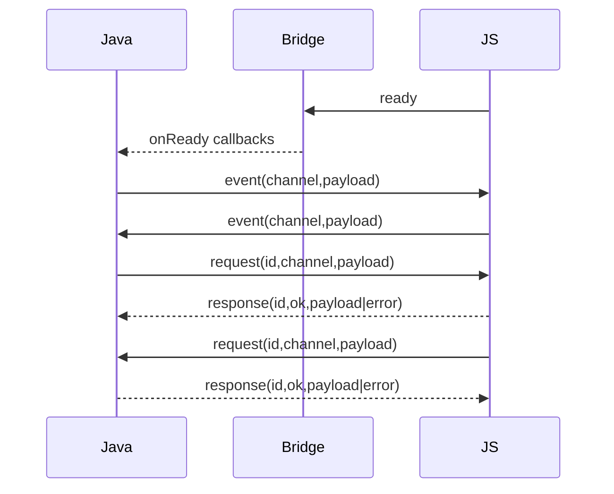

# Bridge

GrapheneBridge is the messaging layer between Java and page JavaScript.

- Java API: `GrapheneBridge` on each `BrowserSurface`/`GrapheneWebViewWidget`
- JS API: `globalThis.grapheneBridge` injected at page load

## Mental Model

- `event`: fire-and-forget message on a channel
- `request`: RPC-style call with success/error response
- `ready`: handshake sent by JS bootstrap when bridge script is installed



## Java API

Get the bridge:

```java
GrapheneBridge bridge = webView.bridge();
```

Register listeners/handlers:

```java
GrapheneBridgeSubscription readySub = bridge.onReady(() -> {
    // JS bootstrap handshake completed.
});

GrapheneBridgeSubscription eventSub = bridge.onEvent("chat:ping", (channel, payloadJson) -> {
    // payloadJson is a JSON string.
});

GrapheneBridgeSubscription requestSub = bridge.onRequest("math:add", (channel, payloadJson) -> {
    return CompletableFuture.completedFuture("{\"result\":42}");
});
```

Emit/request from Java:

```java
bridge.emit("chat:ping", "{\"text\":\"hello\"}");

CompletableFuture<String> responseFuture = bridge.request("math:add", "{\"a\":10,\"b\":32}");
responseFuture.thenAccept(responseJson -> {
    // responseJson is JSON payload from JS.
});
```

## JavaScript API

The bridge object is injected automatically as `globalThis.grapheneBridge`.

```js
const bridge = globalThis.grapheneBridge;

const off = bridge.on("chat:ping", (payload) => {
  console.log("Java event", payload);
});

const unhandle = bridge.handle("math:add", (payload) => {
  return { result: Number(payload.a) + Number(payload.b) };
});

await bridge.emit("chat:pong", { ok: true });
const result = await bridge.request("math:add", { a: 1, b: 2 });

off();
unhandle();
```

## Payload And Contract Rules

- Channel must be non-null and non-blank.
- Java side payloads are JSON strings (`String payloadJson`).
- JS side payloads are normal JS values and are JSON-serialized by bridge code.
- Invalid JSON payloads from Java throw `IllegalArgumentException` on send/parse.

## Handshake And Readiness

- Outbound Java messages queue until JS sends `ready`.
- `onReady` fires after queue is marked ready and flushed.
- On page navigation/start, readiness resets and pending Java requests fail.

## Error Codes

Common response error codes you should handle:

- `handler_not_found`: no handler registered for the channel
- `java_handler_error`: Java request handler threw/failed
- `js_handler_error`: JS request handler threw/failed
- `invalid_request`: malformed request payload (missing id/channel)
- `invalid_response`: handler returned invalid response JSON
- `bridge_error`: generic fallback

On JS, failed requests reject with `Error` containing `error.code` when available.

## Recommended Channel Naming

Use namespaced channel names to avoid collisions:

- `my-mod:ui/open`
- `my-mod:player/stats/request`
- `my-mod:inventory/updated`

## Cleanup

Always unsubscribe bridge subscriptions when no longer needed:

```java
readySub.unsubscribe();
eventSub.unsubscribe();
requestSub.unsubscribe();
```

`GrapheneBridgeSubscription` is `AutoCloseable`, so try-with-resources also works.

---
Next: [Assets And URLs](assets-and-urls.md)
