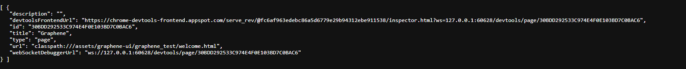
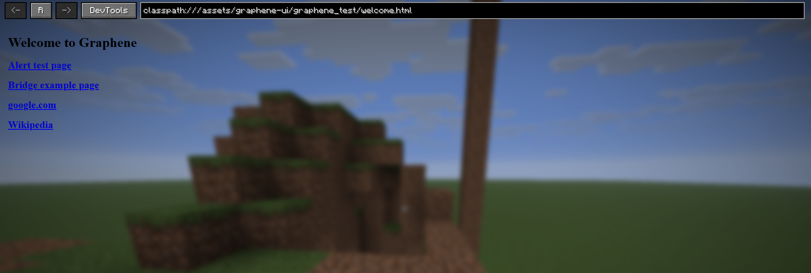

# Debugging

This page covers the most useful runtime diagnostics when integrating Graphene.

## Open Chromium DevTools

Graphene enables remote debugging on a runtime-selected port.

```java
int port = GrapheneCore.runtime().getRemoteDebuggingPort();
String endpoint = "http://127.0.0.1:" + port + "/json";
```

Open the `/json` endpoint in a browser to inspect available targets, then open DevTools for your page target.



## Use The Repository Debug Screen (This Repo)

In this repository's debug mod:

- press `F10` to open `GrapheneBrowserDebugScreen`
- use the `DevTools` button to open the remote debug endpoint
- test bridge events/requests from the sample pages

Recommended sample pages:

- `classpath:///assets/graphene-ui-debug/graphene_test/welcome.html`
- `classpath:///assets/graphene-ui-debug/graphene_test/example-bridge.html`



## Runtime Smoke Tests (This Repo)

The debug module also provides a client command:

- `/graphene test`

This runs runtime/surface/bridge smoke checks and reports pass/fail feedback.

## Logging Tips

- Watch Graphene logs for initialization status and CEF startup args.
- Bridge and load listener exceptions are logged with context.
- If page interactions fail silently, inspect both:
  - Minecraft log output
  - browser console in DevTools

## Quick Checks

- `GrapheneCore.isInitialized()` should be `true` after startup.
- `GrapheneCore.runtime().getRemoteDebuggingPort()` should be `> 0`.
- `bridge.onReady(...)` should fire after page load.
- `globalThis.grapheneBridge` should exist in page console.

If those image files do not exist yet, capture and add them under `docs/images/`.

---
Next: [Advanced Surface](advanced-surface.md)
