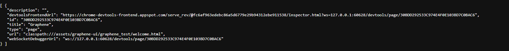
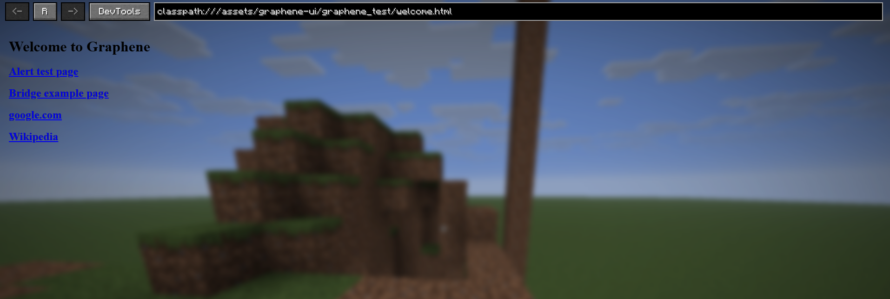

# Debugging

This page covers the most useful Graphene diagnostics for integration work.

## Remote DevTools

Remote debugging is disabled unless configured.

```java
GrapheneConfig config = GrapheneConfig.builder()
        .remoteDebugging(GrapheneRemoteDebugConfig.builder()
                .randomPort()
                .allowedOrigins("https://chrome-devtools-frontend.appspot.com")
                .build())
        .build();

GrapheneCore.register("my-mod-id", config);
```

Runtime inspection:

```java
int port = GrapheneCore.runtime().getRemoteDebuggingPort();
if (port > 0) {
    String endpoint = "http://127.0.0.1:" + port + "/json";
}
```

- `-1`: remote debugging disabled
- `> 0`: active port

Open `/json` in a browser and attach DevTools to your page target.



## Repository Debug Screen

In this repository's debug module:

- Press `F10` to open `GrapheneBrowserDebugScreen`
- Use navigation controls and the `DevTools` button
- Test bridge and page behavior with bundled pages

Useful sample pages:

- `app://assets/graphene-ui-debug/graphene_test/pages/welcome.html`
- `app://assets/graphene-ui-debug/graphene_test/pages/tests.html`
- `app://assets/graphene-ui-debug/graphene_test/pages/js-bridge.html`
- `app://assets/graphene-ui-debug/graphene_test/pages/automated-tests.html`

Classpath equivalents also work.



## Logging

Graphene supports package-prefix debug selectors via the JVM property `graphene.debug`.

Examples:

- `-Dgraphene.debug=*`
- `-Dgraphene.debug=tytoo.grapheneui.internal.bridge`
- `-Dgraphene.debug=tytoo.grapheneui.internal.cef,tytoo.grapheneuidebug`

Selector behavior:

- `*` enables all Graphene debug logs
- comma-separated prefixes enable matching package/subpackage logs

Repository convenience for debug run config:

- `./gradlew runDebugClient -PgrapheneDebug=*`
- `./gradlew runDebugClient -PgrapheneDebug=tytoo.grapheneui.internal.bridge`

When `-PgrapheneDebug=...` is set for `runDebugClient`, the run configuration also enables `fabric.log.level=debug`.

## Quick Checks

- `GrapheneCore.isInitialized()` is `true` after runtime startup.
- `GrapheneCore.runtime().isInitialized()` is `true` when runtime reports ready.
- `globalThis.grapheneBridge` exists in page console.
- `bridge.onReady(...)` fires after page bridge bootstrap finishes.

## API Note

`GrapheneCore.LOGGER` is not public API.
Use your own class-local SLF4J logger in consumer code.

---

Next: [Advanced Surface](advanced-surface.md)
