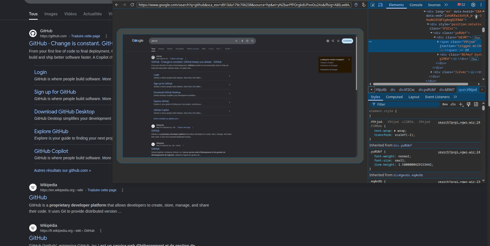

# Use Chromium DevTools

Graphene can expose Chromium's remote debugging endpoint and locate the DevTools target associated with a browser
session.

## Enable remote debugging

Remote debugging is a process-wide setting. Configure it during registration:

```java
GrapheneRemoteDebugConfig remoteDebug =
        GrapheneRemoteDebugConfig.builder()
                .randomPort()
                .allowedOrigins("https://chrome-devtools-frontend.appspot.com")
                .build();

GrapheneGlobalConfig global =
        GrapheneGlobalConfig.builder()
                .remoteDebugging(remoteDebug)
                .build();

GrapheneConfig config = GrapheneConfig.builder().global(global).build();
GrapheneContext context = Graphene.register(ExampleModClient.class, config);
```

Every registered consumer that contributes remote-debug settings must contribute the same value.

## Wait for initialization

The debugging endpoint is unavailable until the shared runtime is running:

```java
context.runtime()
    .initialization()
    .thenRun(
        () ->
            LOGGER.info(
                "DevTools enabled: {}", context.runtime().devTools().isEnabled()));
```

Completion-stage callbacks do not have a guaranteed executor. Select the Minecraft executor when the callback must
update game UI.

## Open DevTools for one browser

```java
BrowserSession browser = webView.surface().browser();

context.runtime()
    .devTools()
    .targetFor(browser)
    .whenComplete(
        (target, failure) ->
            Minecraft.getInstance()
                .execute(
                    () -> {
                      if (failure != null) {
                        LOGGER.error("Failed to discover DevTools target", failure);
                        return;
                      }
                      Util.getPlatform().openUri(target.inspectorUri());
                    }));
```

`targetFor(...)` matches a remotely inspectable page to the supplied `BrowserSession`. `pageTargets()` returns all
discoverable page targets when a diagnostic tool needs the complete list.



## Handle discovery failures

The returned stage can fail with:

| Failure                               | Meaning                                      |
|---------------------------------------|----------------------------------------------|
| `DevToolsDisabledException`           | Remote debugging was not enabled.            |
| `DevToolsRuntimeUnavailableException` | The Graphene runtime is not running.         |
| `DevToolsTargetNotFoundException`     | No target matches the browser URL and title. |
| `DevToolsTargetAmbiguousException`    | Multiple targets match the browser.          |
| `DevToolsDiscoveryException`          | The endpoint could not be queried or parsed. |

Asynchronous wrappers may expose the original failure as a completion exception's cause. Unwrap it before selecting a
user-facing message.

## Security

Remote debugging grants inspection and control of browser pages. Enable it for development builds, bind Graphene's
services to loopback, and do not expose the port to untrusted networks.

## Next steps

- [Use HTTP assets for a frontend edit-refresh loop](manage-assets-and-frontend-development.md).
- [Troubleshoot target discovery](troubleshoot.md).
