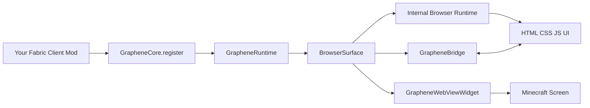

# Graphene Overview

Graphene is a client-side UI library for Fabric mods on Minecraft `1.21.11`.
It embeds Chromium (via JCEF) so you can render HTML/CSS/JS interfaces in-game, then connect those UIs to Java mod logic.

## Core Concepts

- `GrapheneCore`: static entry point (`register(modId, config)`, runtime access, surface manager)
- `GrapheneRuntime`: runtime status/debug view exposed by `GrapheneCore.runtime()`
- `GrapheneHttpServer`: optional loopback HTTP server view exposed by `GrapheneRuntime.httpServer()`
- `BrowserSurface`: off-screen browser surface (size, resolution, viewBox, render APIs)
- `GrapheneWebViewWidget`: Minecraft widget wrapper for a `BrowserSurface`
- `GrapheneBridge`: Java <-> JS messaging API (events + request/response)

## Architecture

## Typical Runtime Flow

1. Your mod calls `GrapheneCore.register("my-mod-id")` during client init.
2. Once client loading is finished, Graphene initializes the shared runtime.
3. You create a `GrapheneWebViewWidget` or `BrowserSurface`.
4. A page loads through `app://assets/...`, `classpath:///assets/...`, or any normal URL.
5. Graphene injects the JS bridge bootstrap script.
6. JS sends a `ready` handshake.
7. Bridge messages start flowing both ways.

## Where To Go Next

- Setup and version constraints: [installation.md](./installation.md)
- First UI and screen integration: [quickstart.md](./quickstart.md)
- Java <-> JS messaging contracts: [bridge.md](./bridge.md)
- Rendering and sizing controls: [advanced-surface.md](./advanced-surface.md)

---

Next: [Installation](installation.md)
