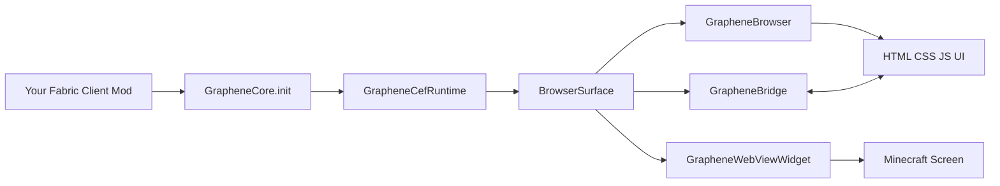

# Graphene Overview

Graphene is a client-side UI library for Fabric mods on Minecraft `1.21.11`.
It embeds Chromium (via JCEF) so you can render HTML/CSS/JS interfaces in-game, then connect those UIs to Java mod logic.

## Core Concepts

- `GrapheneCore`: static entry point (`init()`, runtime access, surface manager)
- `GrapheneCefRuntime`: owns CEF app/client lifecycle and bridge runtime
- `BrowserSurface`: off-screen browser surface (size, resolution, viewBox, render/update APIs)
- `GrapheneWebViewWidget`: Minecraft widget wrapper for a `BrowserSurface`
- `GrapheneBridge`: Java <-> JS messaging API (events + request/response)

## Architecture

## Typical Runtime Flow

1. Your mod calls `GrapheneCore.init()` once during client init.
2. You create a `GrapheneWebViewWidget` or `BrowserSurface`.
3. A page loads through `classpath:///...` or any normal URL.
4. Graphene injects the JS bridge bootstrap script.
5. JS sends a `ready` handshake.
6. Bridge messages start flowing both ways.

## Where To Go Next

- Setup and version constraints: `docs/installation.md`
- First UI and screen integration: `docs/quickstart.md`
- Java <-> JS messaging contracts: `docs/bridge.md`
- Rendering and sizing controls: `docs/advanced-surface.md`

---
Next: [Installation](installation.md)
