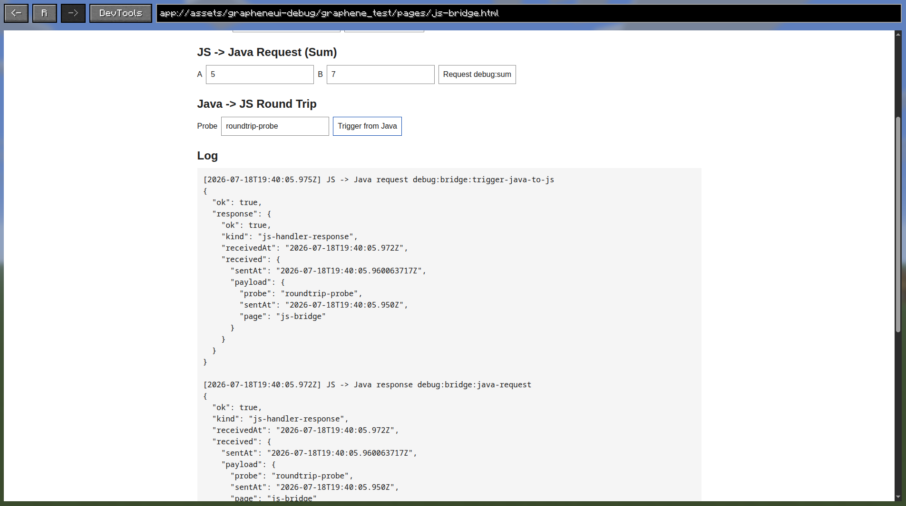

# Connect Java and JavaScript

This tutorial extends the first web screen with bidirectional events and request/response messages.

Complete [Build Your First Web Screen](first-web-screen.md) first. The examples below use its `ExampleWebScreen` and
packaged page.

## 1. Define bridge payloads

Add small records for the payloads exchanged with the page:

```java
record GreetingRequest(String name) {}

record GreetingResponse(String message) {}

record TextRequest(String value) {}

record TextResponse(String value) {}

record StatusMessage(String message) {}
```

Graphene's JSON helpers serialize and deserialize these records with Gson.

## 2. Register Java handlers

Keep subscriptions with the screen so they can be removed during cleanup:

```java
private final List<GrapheneSubscription> bridgeSubscriptions = new ArrayList<>();
```

After constructing `webView`, register the handlers:

```java
GrapheneBridge bridge = webView.bridge();

bridgeSubscriptions.add(
    bridge.onRequestJson(
        "example:greet",
        GreetingRequest.class,
        (channel, request) ->
            CompletableFuture.completedFuture(
                new GreetingResponse("Hello, " + request.name() + "!"))));

bridgeSubscriptions.add(
    bridge.onEvent(
        "example:page-ready",
        (channel, payloadJson) ->
            bridge
                .requestJson(
                    "example:uppercase",
                    new TextRequest("message from Java"),
                    TextResponse.class)
                .thenAccept(
                    response ->
                        bridge.emitJson(
                            "example:status",
                            new StatusMessage("Java received: " + response.value())))));
```

Required imports:

```java
import io.github.trethore.graphene.api.GrapheneSubscription;
import io.github.trethore.graphene.api.bridge.GrapheneBridge;
import java.util.ArrayList;
import java.util.List;
import java.util.concurrent.CompletableFuture;
```

The first handler answers a JavaScript request. The second waits for the page to announce that its handlers are
installed, issues a Java -> JavaScript request, and emits the result back as a Java -> JavaScript event.

## 3. Use the bridge from JavaScript

Replace `app.js` with:

```javascript
async function connect() {
  const bridge = globalThis.grapheneBridge;
  await bridge.ready();

  const output = document.getElementById("status");

  bridge.on("example:status", (payload) => {
    output.textContent = payload.message;
  });

  bridge.handle("example:uppercase", (payload) => ({
    value: payload.value.toUpperCase(),
  }));

  const greeting = await bridge.request("example:greet", {
    name: "Graphene developer",
  });
  output.textContent = greeting.message;

  await bridge.emit("example:page-ready", null);
}

connect().catch((error) => {
  document.getElementById("status").textContent = error.message;
});
```

The bridge methods use ordinary JSON-compatible JavaScript values. Events are one-way; requests return promises that
settle with a response or error.

## 4. Clean up Java subscriptions

Screen closure closes the widget, but subscriptions owned by your screen should still have an explicit cleanup path:

```java
private void closeBridgeSubscriptions() {
  bridgeSubscriptions.forEach(GrapheneSubscription::unsubscribe);
  bridgeSubscriptions.clear();
}
```

Call this method when you explicitly close a persistent widget or replace its bridge handlers. Subscription cleanup is
idempotent.

## 5. Verify the round trip

Open the screen. The page first shows the Java greeting, then a status similar to:

```text
Java received: MESSAGE FROM JAVA
```

Graphene's debug client provides a broader bridge test covering the same message directions:



## Channel rules

- Use stable, namespaced channels such as `example:greet`.
- Do not use channels beginning with `graphene:`. That prefix is reserved for Graphene's platform integrations.
- Register page-side handlers again after navigation because a new document receives a new JavaScript environment.
- Bridge exposure is document-dependent. Packaged Graphene assets are allowed by default; arbitrary remote pages are
  not.

## Next steps

- [Look up the complete JavaScript bridge API](../reference/javascript-bridge-api.md).
- [Control and observe a browser session](../how-to/control-and-observe-the-browser.md).
- [Understand assets, origins, and bridge security](../explanation/assets-origins-and-bridge-security.md).
